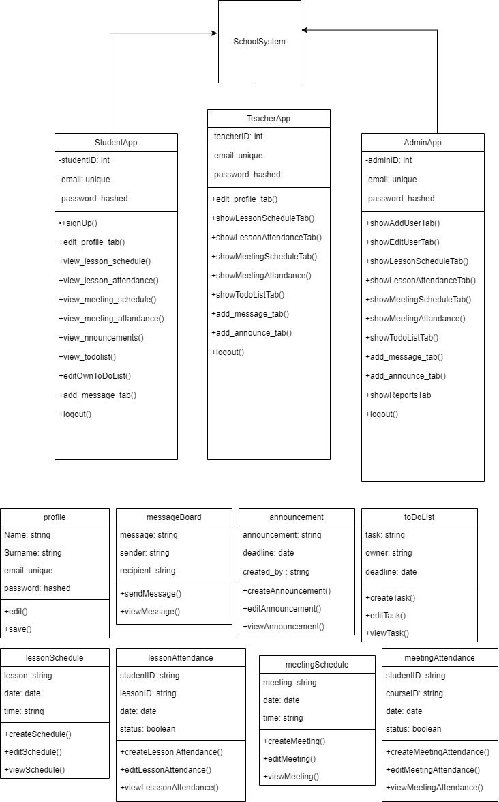
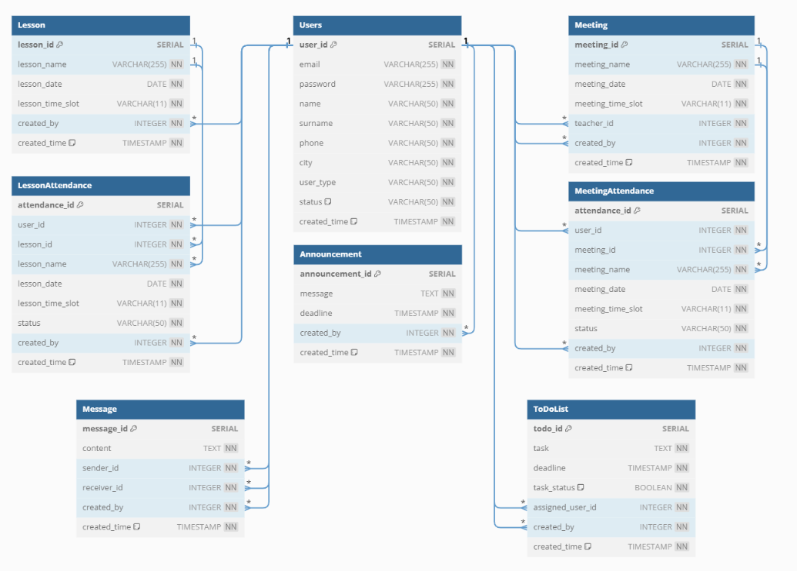

# Smart School 2.0

## Overview

This project focuses on developing a Python application integrating GUI elements and PostgreSQL database, supported by comprehensive UML and ERD diagrams.
Aimed at enhancing educational experiences, it is an excellent opportunity to demonstrate technical proficiency, problem-solving skills, and effective teamwork.

## Features

•	Object-Oriented Programming (OOP) approach

•	Integration with PostgreSQL for database management

•	Use of UML and ERD diagrams for planning and visualization

•	Implementation of GUI using PyQt5

## Aim and Objectives

The project aims to:

•	Develop technical proficiency in Python, PostgreSQL, and GUI development

•	Enhance problem-solving and project management skills

•	Foster collaboration and effective communication within a team

•	Embrace agile methodologies and version control using Git

The project encompasses the following three primary user types:

### Admin

After logging into the application, the admin is recognized and directed to the Admin Panel. Here, the admin can create teacher accounts and make modifications to these accounts.
When the admin login, admin will reach the admin page. Admin should be able to run all the functions. Admin should approve/reject new accounts requested by the teacher.

### Teacher

Users who logged in as teachers can access the teacher interface and perform functionalities as indicated in the diagram. When the teachers login, they will reach the Teacher Page.
Every teacher has a profile page that contains their own information. Teachers can create, edit and view the annual course schedule.

### Student

Students can log in or create a new account. These users can modify their own personal to-do lists. Additionally, they can access to information created by their teachers.
When the students login, they will reach the Student Page. They can edit their own informations. Students can view the annual course schedule (except for the teacher of those lessons).

## Tools and Technologies

•	Python

•	PyQt5 for GUI development

•	PostgreSQL as DBMS

•	UML and ERD diagrams for design and documentation

## Project Management

•	Agile methodologies and regular team meetings for progress tracking

•	Version control using Git and GitHub

## Requirements

•	Knowledge of Python programming

•	Basic understanding of databases and SQL

•	Familiarity with Git and GitHub for version control

•	Experience with PyQt5 is a plus

## Diagrams:

Class Diagram 

Use Case Diagram 

ERD Diagram

