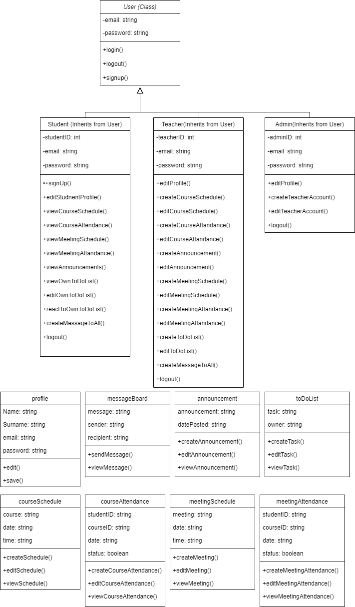

Smart School 2.0/n

Overview/n
This project focuses on developing a Python application integrating GUI elements and PostgreSQL database, supported by comprehensive UML and ERD diagrams./n 
Aimed at enhancing educational experiences, it is an excellent opportunity to demonstrate technical proficiency, problem-solving skills, and effective teamwork./n

Features/n
•	Object-Oriented Programming (OOP) approach/n
•	Integration with PostgreSQL for database management/n
•	Use of UML and ERD diagrams for planning and visualization/n
•	Implementation of GUI using PyQt5/n

Aim and Objectives/n
The project aims to:/n
•	Develop technical proficiency in Python, PostgreSQL, and GUI development/n
•	Enhance problem-solving and project management skills/n
•	Foster collaboration and effective communication within a team/n
•	Embrace agile methodologies and version control using Git/n

The project encompasses the following three primary user types:/n

Admin/n
After logging into the application, the admin is recognized and directed to the Admin Panel. Here, the admin can create teacher accounts and make modifications to these accounts./n 
When the admin login, admin will reach the admin page. Admin should be able to run all the functions. Admin should approve/reject new accounts requested by the teacher./n

Teacher/n
Users who logged in as teachers can access the teacher interface and perform functionalities as indicated in the diagram. When the teachers login, they will reach the Teacher Page./n 
Every teacher has a profile page that contains their own information. Teachers can create, edit and view the annual course schedule./n

Student/n
Students can log in or create a new account. These users can modify their own personal to-do lists. Additionally, they can access to information created by their teachers./n 
When the students login, they will reach the Student Page. They can edit their own informations. Students can view the annual course schedule (except for the teacher of those lessons)./n

Tools and Technologies/n
•	Python/n
•	PyQt5 for GUI development/n
•	PostgreSQL as DBMS/n
•	UML and ERD diagrams for design and documentation/n

Project Management/n
•	Agile methodologies and regular team meetings for progress tracking/n
•	Version control using Git and GitHub/n

Requirements/n
•	Knowledge of Python programming/n
•	Basic understanding of databases and SQL/n
•	Familiarity with Git and GitHub for version control/n
•	Experience with PyQt5 is a plus/n

Links for Diagrams:
Class Diagram  
Use Case Diagram  
ERD Diagram  

